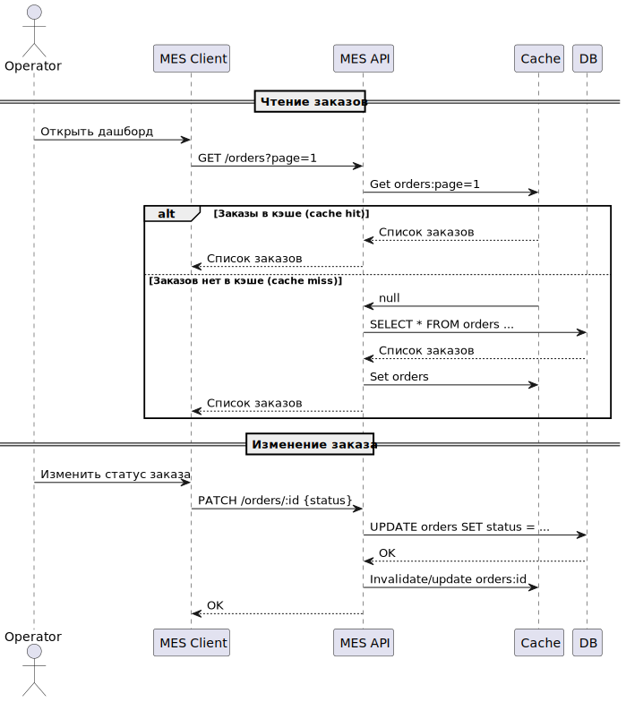

# Кэширование: выбор подходов, технологий и планирование

## Context and Problem Statement

Система MES стала медленнее загружать дашборд заказов, добавление пагинации и фильтров не помогло.
Вероятной причиной является высокая нагрузка на БД, вызванная множеством параллельных запросов от MES, CRM и клиентов.
Для ускорения отклика и уменьшения нагрузки на БД предлагается внедрить кэширование часто используемых данных.

Помимо кэширования БД MES, стоит кэшировать данные из S3, если пользователи часто запрашивают стоимость одной
модели в разных конфигурациях.
Также нужно кэшировать непосредственно API MES для долгого процесса расчета стоимости.
При необходимости можно добавить кэш для БД магазина, но это не является приоритетом, так как там сейчас нет проблем.

## Considered Options

### Дашборд MES

Так как много операторов запрашивают одни и те же страницы дашборда, то можно использовать гибридное кэширование: на
стороне клиента и на сервере.

#### Клиентское кэширование

Страницы дашборда можно кэшировать на клиенте для всех, чтобы не запрашивать и не пересоздавать их каждый раз.
При этом нужно каждый раз проверять кэш на сервере, чтобы не показывать устаревшую информацию, и два оператора не взяли
один и тот же заказ.
Можно использовать заголовки `Cache-Control: must-revalidate, max-age=0`.

#### Серверное кэширование

На сервере можно кэшировать сами заказы, чтобы не запрашивать их из БД каждый раз при создании страницы.
При добавлении/обновлении заказа, обновится только одна запись в кэше и БД.
После чего при создании дашборда заказы будут браться из кэша, а не из БД.

Использовать будем Cache-aside, так как он проще в реализации, не зависит от схемы БД, нет единой точки отказа, проще
отладка.
Другие подходы не подходят по следующим причинам:

- Read/write-through: зависимость от схемы БД, кэш как точка отказа, сложнее настройка/отладка.
- Write-behind: сложная реализация гарантированной доставки и согласованности, отладка.
- Refresh-ahead: в нашем случае нужно реагировать на изменения в реальном времени, а не по расписанию.
- CQRS: избыточен для нашего масштаба, сложная реализация разных моделей БД, синхронизации, отладка, поддержка.

#### Инвалидация

По событию/ключу: при создании/обновлении заказа нужно обновить соответствующие записи в кэше.
По времени не подходит, так как нужно мгновенно отображать изменения в заказах.

### Расчет стоимости

Использовать серверное кэширование Cache-aside с инвалидацией по времени, например, 30 минут.

### S3

Получение и запись в S3 - значительно медленнее, чем кэш или даже БД, поэтому аналогично можно сделать Cache-aside
кэширование с инвалидацией по ключам.

## Decision Outcome

Внедрить кэширование на стороне клиента и сервера для дашборда MES, а также серверное кэширование для расчета стоимости
и данных S3.
Использовать Cache-aside с инвалидацией по событию для дашборда MES, по времени для расчета стоимости, по ключу для S3.

Стоит отдельно рассмотреть добавление реплик и шардирование для БД, чтобы еще больше снизить нагрузку на неё.

Диаграмма последовательности действий работы кэша:

### Consequences

- Снижение нагрузки на БД, что уменьшает вероятность различных ошибок
- Ускорение отклика системы и загрузки страниц
- Гибкость кэширования
- Увеличение сложности системы
